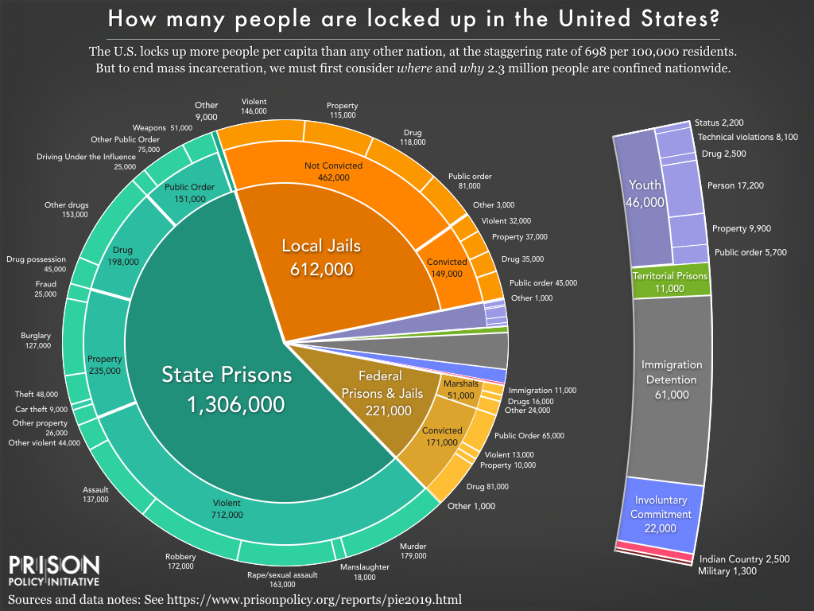
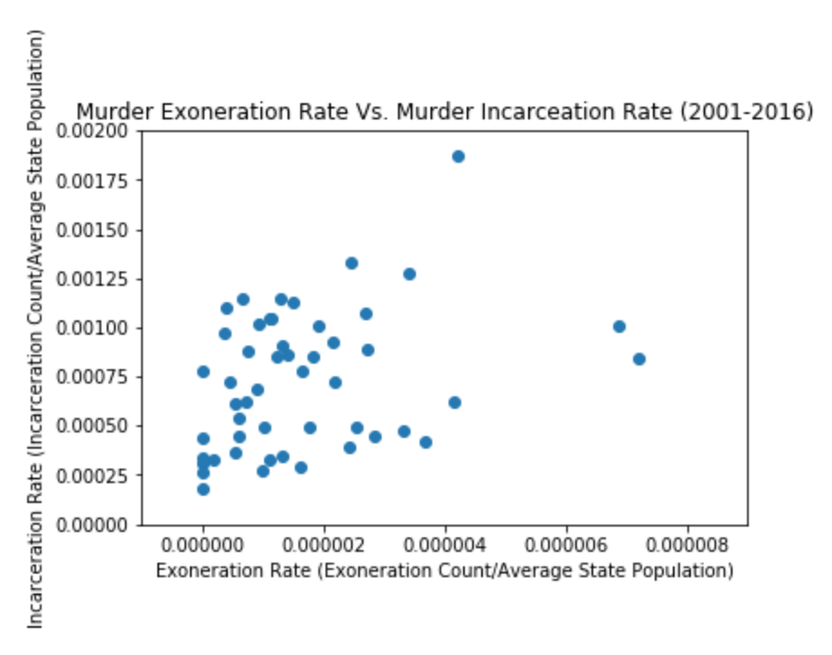
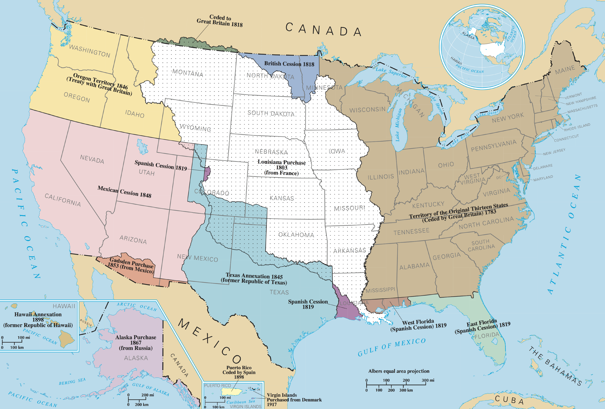
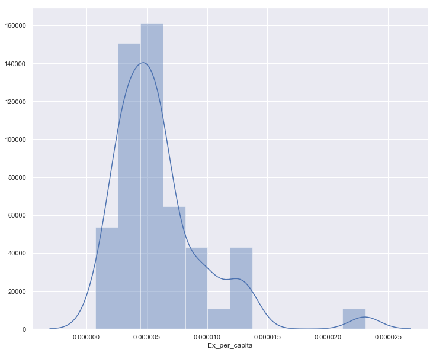

# Module 3 Project: Analyzing U.S. Prison Statistics

## Scope of the project

<<<<<<< HEAD
For the Mod 3 project, we set out to investigate government data related to the incarcerated population in the United States. The U.S. has the [highest incarceration rate per capita](https://www.prisonpolicy.org/reports/pie2019.html) of _any_ nation, and the data that elucidate the matter are diffuse and difficult to parse. 

=======
For the Module 3 six-day project, we set out to investigate government data related to the incarcerated population in the United States. The U.S. has the [highest incarceration rate per capita](https://www.prisonpolicy.org/reports/pie2019.html) of _any_ nation, and the data that elucidate the matter are diffuse and difficult to parse. 

>>>>>>> ad914eaee66ab037012ac33a24fe95f7ef946d83

Some common problems include:

+ Nonstandard terminology and labels
+ Differing methodologies and units of measurement
+ Disparate recording periods
+ Obfuscatory data retention (and non-retention) practices
+ Immense scope of the subject matter

We aggregated data from the [Bureau of Justice Statistics](https://www.kaggle.com/christophercorrea/prisoners-and-crime-in-united-states/kernels), the [ProPublica Congress API](https://projects.propublica.org/api-docs/congress-api/), and the [National Institute of Justice](https://nij.gov/journals/279/Pages/wrongful-convictions-and-dna-exonerations.aspx) research on exonerations for crimes to begin to explore some of the relationships between the data and the criminal justice system. 

## Hypothesis 1: The mean prison population has increased from 2012 to 2016

<<<<<<< HEAD
${H_0}: \textrm{The mean prison population has not changed significantly from 2012 to 2016}$

${H_\alpha}: \textrm{The mean prison population has significanlty changed from 2012 to 2016}$

$\alpha = 0.05$
=======
H0: The mean prison population has not changed significantly from 2012 to 2016

Ha: The mean prison population has significanlty changed from 2012 to 2016

a = 0.05
>>>>>>> ad914eaee66ab037012ac33a24fe95f7ef946d83

### Method

Student's t-test

### Findings

<<<<<<< HEAD
We reject ${H_0}$ since our calculated t-statistic is 2.19, which is greater than the t-critical value, 1.66.

## Hypothesis 2: The proportion of incarcerated people to the total population differs in correlation with whether a state has Republican or Democratic senators 

${H_0}: \textrm{There is no difference in the total incarcerated population between states with Republican and Democratic senators}$
${H_\alpha}: \textrm{There is a difference between the proportion of incarcerated persons to total population between Republican and Democratic states
}$

$\alpha = 0.05$
=======
We reject H0 since our calculated t-statistic is 2.19, which is greater than the t-critical value, 1.66.

## Hypothesis 2: The proportion of incarcerated people to the total population differs in correlation with whether a state has Republican or Democratic senators 

H0: There is no difference in the total incarcerated population between states with Republican and Democratic senators
Ha: There is a difference between the proportion of incarcerated persons to total population between Republican and Democratic states

a = 0.05$
>>>>>>> ad914eaee66ab037012ac33a24fe95f7ef946d83

### Method

ANOVA

### Findings

For the 114th Congress:
+ F value: 2.81
+ p value: 0.07

Result: Cannot reject null hypothesis. Further data collection warranted to increase power of hypothesis test.

<<<<<<< HEAD

=======

>>>>>>> ad914eaee66ab037012ac33a24fe95f7ef946d83

### Next step: Increase the power of the hypothesis test with a larger sample (add Congresses)

The F ratio is the ratio of two mean square values. If the null hypothesis is true, we would expect F to have a value close to 1. A large F ratio means that the variation among group means is greater than chance would predict. 

This large an F ratio might suggest the null hypothesis is wrong (the data are not sampled from populations with the same mean), but our p-value is just outside of statistical significance.

_What next?_

+ Two-way ANOVA, with time and political valence (to increase observations and therefore power)
+ Repeated measures ANOVA (because prison population is expected to be similar over time) 

<<<<<<< HEAD
## Hypothesis 3:

## Hypothesis 4: Eastern states will have a lower rate of exonerations than Western states

${H_0}: \textrm{The exoneration rate for murder (exoneration count/population) for Eastern states is the same or higher than the exoneration rate for murder in other states.}$
${H_\alpha}: \textrm{The exoneration rate for murder (exoneration count/population) for Eastern is lower than the exoneration rate for murder in other states.}$

$\alpha = 0.05$
=======
## Hypothesis 3: The rate of exoneration for murder in a state is correlated to the rate of incarceration for murder in that state

H0: The exoneration for murder rate for a state is not correlated with the incarceration for murder rate in that state

Ha: The exoneration for murder rate for a state is correlated with the incarceration for murder rate in that state

a = 0.05

### Method

Used scipy.stats.pearsonr to obtain Pearson’s correlation coefficient and two-tailed p-value 

The murder exoneratation rate for each state was calculated by taking the aggregate of all murder manslaughter in the United States between 2001 and 2016 for each state and dividing that number by the average state population between 2001 and 2016.

The murder incarceration rate for each state was calculated by taking the aggregate of all murder incarcerations in the United States between 2001 and 2016 for each state and dividing that number by the average state population between 2001 and 2016.

Federal exonerations and incarcerations were not counted.  Data from Puerto Rico was not included in the final test.

### Findings

Since our alpha value is 0.05 and our calculated p-value is 0.0213, we can reject our null hypothesis. The exoneration rate for a state is positively correlated by 0.3248 to the incarceration rate for a state.

States that have a higher rate of exoneration for murder are seeing higher rates of incarceration for murder.

## Hypothesis 4: Eastern states will have a lower rate of exonerations than Western states

H0: The exoneration rate for murder (exoneration count/population) for Eastern states is the same or higher than the exoneration rate for murder in other states.
Ha: The exoneration rate for murder (exoneration count/population) for Eastern is lower than the exoneration rate for murder in other states.

a = 0.05$
>>>>>>> ad914eaee66ab037012ac33a24fe95f7ef946d83

### Method

Independent 2-sample t-test

### Findings

Failed to reject the null hypothesis

<<<<<<< HEAD

=======

>>>>>>> ad914eaee66ab037012ac33a24fe95f7ef946d83
