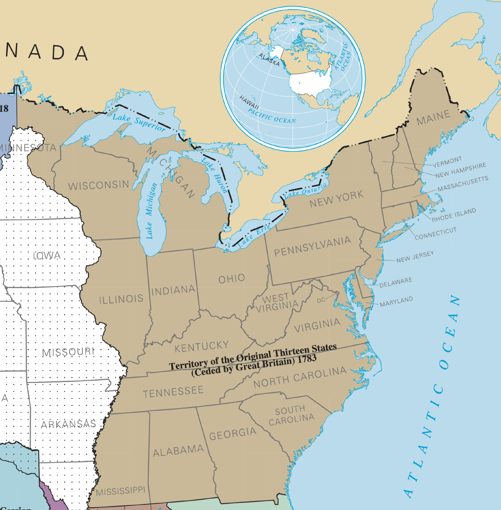

# Module 3 Project: Analyzing U.S. Prison Statistics

## Scope of the project

For the Mod 3 project, we set out to investigate government data related to the incarcerated population in the United States. The U.S. has the [highest incarceration rate per capita](https://www.prisonpolicy.org/reports/pie2019.html) of _any_ nation, and the data that elucidate the matter are diffuse and difficult to parse. 

Some common problems include:

+ Nonstandard terminology and labels
+ Differing methodologies and units of measurement
+ Disparate recording periods
+ Obfuscatory data retention (and non-retention) practices
+ Immense scope of the subject matter

We aggregated data from the [Bureau of Justice Statistics](https://www.kaggle.com/christophercorrea/prisoners-and-crime-in-united-states/kernels), the [ProPublica Congress API](https://projects.propublica.org/api-docs/congress-api/), and the [National Institute of Justice](https://nij.gov/journals/279/Pages/wrongful-convictions-and-dna-exonerations.aspx) research on exonerations for crimes to begin to explore some of the relationships between the data and the criminal justice system. 

## Hypothesis 1: The mean prison population has increased from 2012 to 2016

${H_0}: \textrm{The mean prison population has not changed significantly from 2012 to 2016}$

${H_\alpha}: \textrm{The mean prison population has significanlty changed from 2012 to 2016}$

$\alpha = 0.05$

### Method

Student's t-test

### Findings

We reject ${H_0}$ since our calculated t-statistic is 2.19, which is greater than the t-critical value, 1.66.

## Hypothesis 2: The proportion of incarcerated people to the total population differs in correlation with whether a state has Republican or Democratic senators 

${H_0}: \textrm{There is no difference in the total incarcerated population between states with Republican and Democratic senators}$
${H_\alpha}: \textrm{There is a difference between the proportion of incarcerated persons to total population between Republican and Democratic states
}$

$\alpha = 0.05$

### Method

ANOVA

### Findings

For the 114th Congress:
+ F value: 2.81
+ p value: 0.07

Result: Cannot reject null hypothesis. Further data collection warranted to increase power of hypothesis test.

### Next step: Increase the power of the hypothesis test with a larger sample (add Congresses)

The F ratio is the ratio of two mean square values. If the null hypothesis is true, we would expect F to have a value close to 1. A large F ratio means that the variation among group means is greater than chance would predict. 

This large an F ratio might suggest the null hypothesis is wrong (the data are not sampled from populations with the same mean), but our p-value is just outside of statistical significance.

_What next?_

+ Two-way ANOVA, with time and political valence (to increase observations and therefore power)
+ Repeated measures ANOVA (because prison population is expected to be similar over time) 

## Hypothesis 3:

## Hypothesis 4: Eastern states will have a lower rate of exonerations than Western states

${H_0}: \textrm{The exoneration rate for murder (exoneration count/population) for Eastern states is the same or higher than the exoneration rate for murder in other states.}$
${H_\alpha}: \textrm{The exoneration rate for murder (exoneration count/population) for Eastern is lower than the exoneration rate for murder in other states.}$

$\alpha = 0.05$

### Method

Independent 2-sample t-test

### Findings

Failed to reject the null hypothesis

